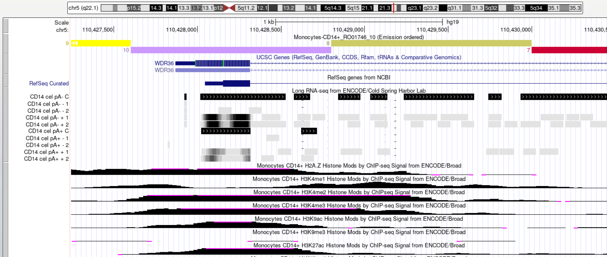

#### [IPYNB код](/DZ3.ipynb)
#### [Папка с выдачей ChromHMM](/Output/)
*[HTML-страница](webpage_10.html)*

Emission | Transition | HeLa-S3_10 Overlap Enrichment
-|-|-
||

## Список меток

Метка | Название файла (ссылки есть в Jupyter Notebook'е)
-|-
Контроль | wgEncodeBroadHistoneMonocd14ro1746ControlAlnRep1.bam
H2az | wgEncodeBroadHistoneMonocd14ro1746H2azAlnRep1.bam
H3k27ac |	wgEncodeBroadHistoneMonocd14ro1746H3k27acAlnRep1.bam
H3k27me3 |	wgEncodeBroadHistoneMonocd14ro1746H3k27me3AlnRep1.bam	 
H3k36me3 |	wgEncodeBroadHistoneMonocd14ro1746H3k36me3AlnRep1.bam
H3k04me1 |	wgEncodeBroadHistoneMonocd14ro1746H3k04me1AlnRep1.bam
H3k04me2 |	wgEncodeBroadHistoneMonocd14ro1746H3k04me2AlnRep1.bam
H3k04me3 |	wgEncodeBroadHistoneMonocd14ro1746H3k04me3AlnRep1.bam
H3k79me2 |	wgEncodeBroadHistoneMonocd14ro1746H3k79me2AlnRep1.bam
H3k09ac |	wgEncodeBroadHistoneMonocd14ro1746H3k09acAlnRep1.bam
H3k09me3  |	wgEncodeBroadHistoneMonocd14ro1746H3k09me3AlnRep1.bam
H4k20me1 |	wgEncodeBroadHistoneMonocd14ro1746H4k20me1AlnRep1.bam

## Эпигенетические типы

Тип | Расположение | Метки | Название
-|-|-|-
1 | Границы гена| H3k27me3 | gene boundaries
2 | Гетерохроматин, связь с ламиной | H3k09ac | heterochromatin
3 | Энхансер | H3k09me3 | enhancer
4 | Экзоны и интроны | H3k36me3 | exons & introns
5 | Интроны | H3k36me3 H4k20me1 H3k79me2 H3k27ac | introns
6 | Экзоны и интроны | H3k09ac | exons & introns
7 | Экзоны | H3k79me2 H4k20me1 H3k04me2 H3k27ac  | exons
8 | Начало экзона | H3k79me2 H3k04me3 H3k04me2 H3k04me1 H3k27ac | exons beginning
9 | Терминатор и связь с ламиной | H3k04me1 H3k27ac H3k04me2 H2az | lamina
10 | Промотор и терминатор | H2az H3k09ac H3k04me1 H3k04me2 H3k04me3 H3k27ac H3k79me2 H3k27me3 | promoter or terminator

### Скриншоты из UCSC
Эпигенетические типы | Фото
-|-
1, 2, 9, 10 | 
4, 5, 6 | 
3, 7 | 
8 | 

## Бонусная задача

Ссылка на файлы:
[Файлы](/bon/)

